# Windows 10 VM Setup Guide

This guide walks you through creating and setting up a Windows 10 virtual machine (VM) using VMware Workstation Pro. It also includes steps to install VMware Tools for better performance and integration.

---

## Step 1: Download the Windows 10 ISO
1. Go to the [Microsoft Windows 10 download page](https://www.microsoft.com/software-download/windows10).
    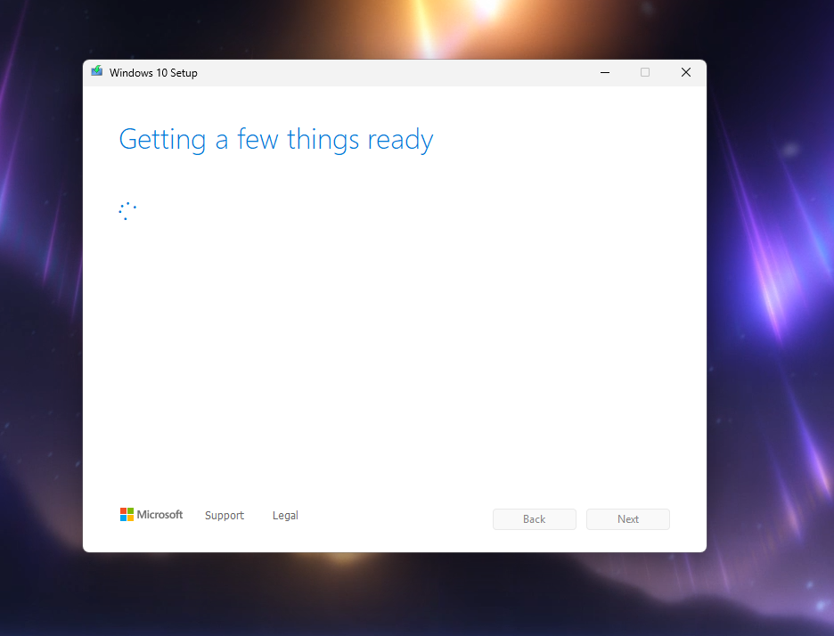
2. Click **Download Now** under the **Create Windows 10 Installation Media** section.
    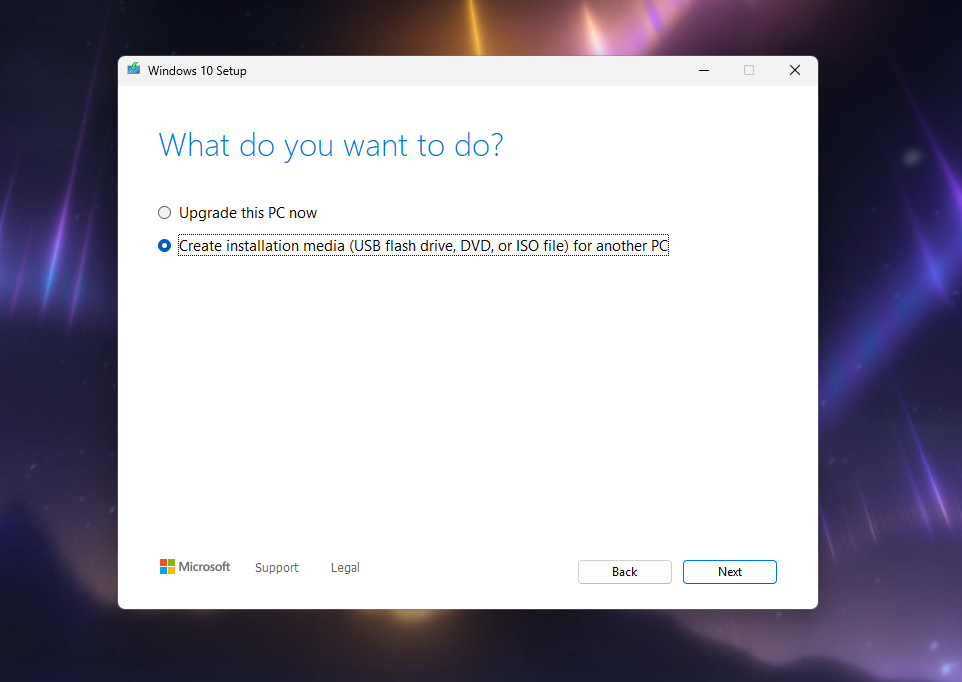
3. Choose the following settings:
   - Language: **English** (or your preferred language).
   - Edition: **Windows 10**.
   - Architecture: **64-bit (x64)**.
    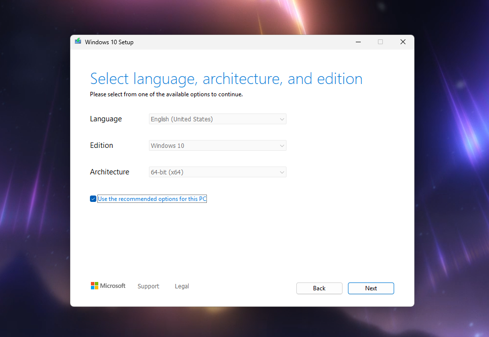
4. Select **ISO file** as the output and save it to your computer (e.g., `C:\Downloads\Windows10.iso`).
    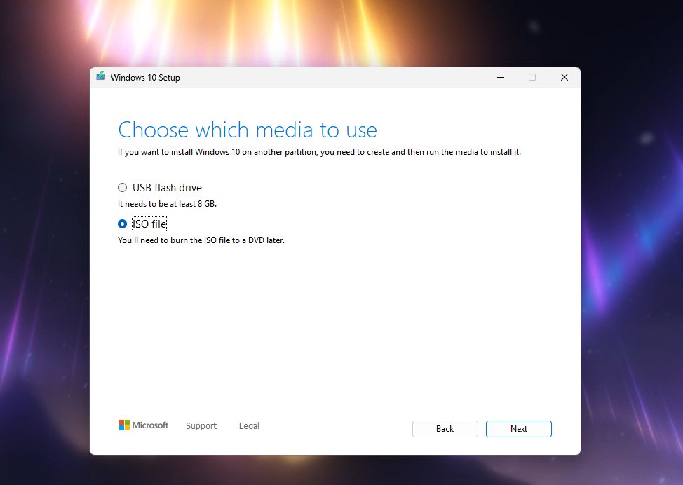  
    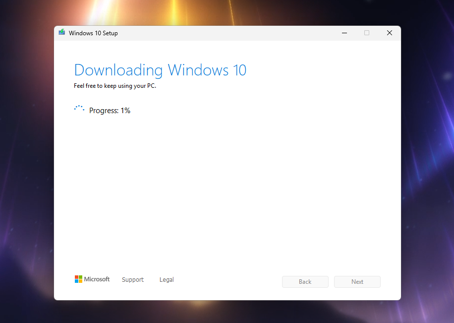 

---

## Step 2: Create a New Virtual Machine in VMware Workstation Pro
1. Open **VMware Workstation Pro**.
2. Click **Create a New Virtual Machine**.
3. In the New Virtual Machine Wizard:
   - Select **Typical (recommended)** and click **Next**.
   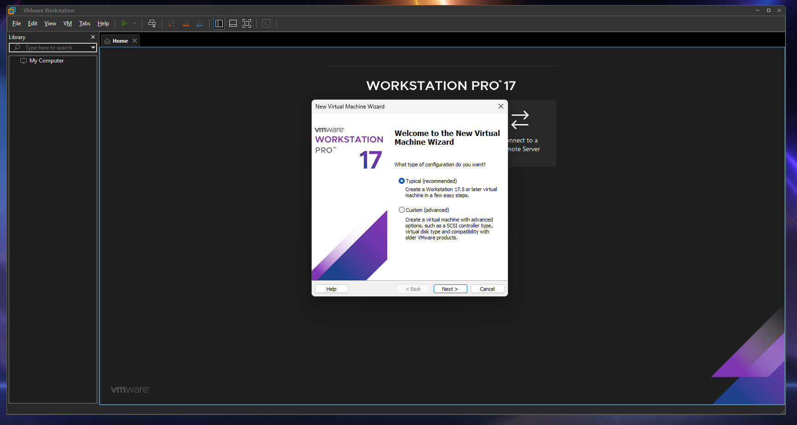
   - Choose **Installer disc image file (ISO)** and browse to the Windows 10 ISO file you downloaded.
   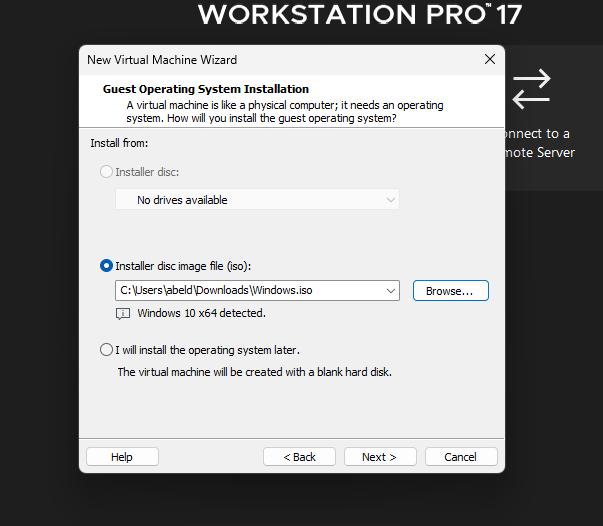
   - Click **Next**.

---

## Step 3: Configure VM Settings
1. **Operating System**:
   - VMware will detect the OS as **Microsoft Windows**.
   - Click **Next**.

2. **Name and Location**:
   - Name your VM (e.g., `Windows 10 VM`).
   - Choose a location to store the VM files (e.g., `D:\VMs\Windows10`).
   - Click **Next**.
    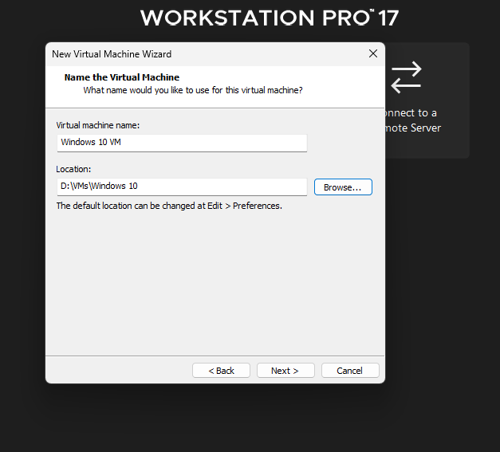
3. **Disk Capacity**:
   - Set the maximum disk size to **50GB** (or more if you have space).
   - Select **Store virtual disk as a single file** (recommended for better performance).
   - Click **Next**.
    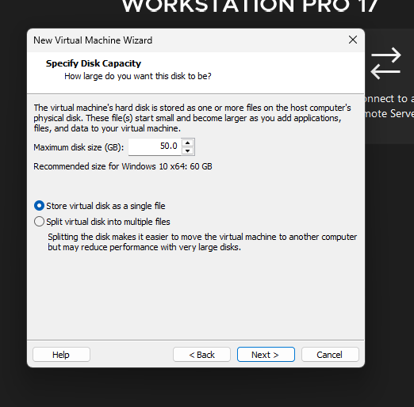
4. **Customize Hardware** (optional but recommended):
   - Click **Customize Hardware** to adjust resources:
     - **Memory**: Allocate **4GB RAM** (minimum) or **8GB RAM** (recommended).
     - **Processors**: Allocate **2 CPU cores** (minimum) or **4 CPU cores** (recommended).
     - **Network Adapter**: Ensure it’s set to **NAT** (default).
   - Click **Close** and then **Finish**.
    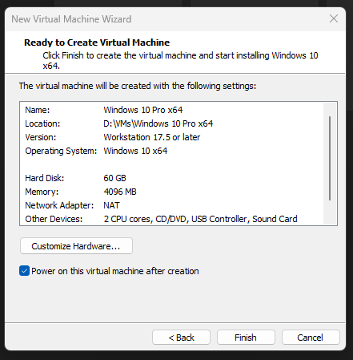
---

## Step 4: Install Windows 10 on the VM
1. Start the VM by selecting it and clicking **Play Virtual Machine**.
    
2. The VM will boot from the Windows 10 ISO. Follow the on-screen instructions:
   - Select your language, time, and keyboard preferences, then click **Next**.
   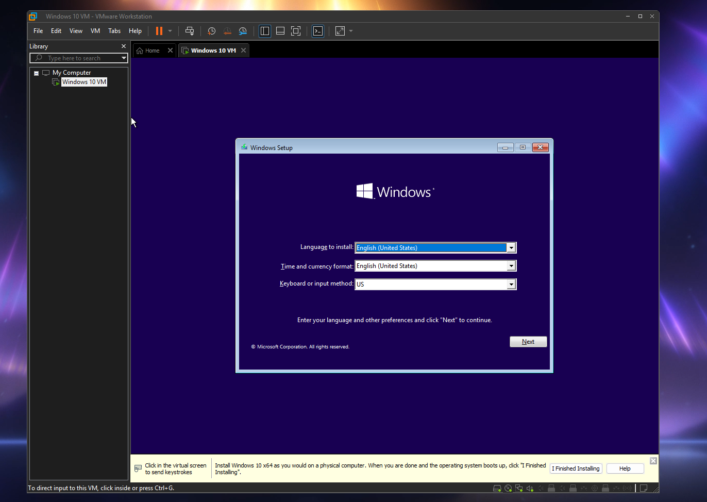
   - Click **Install Now**.
   - Enter your product key (or skip if using the evaluation version).
   - Accept the license terms and click **Next**.
   - Choose **Custom: Install Windows only (advanced)**.
   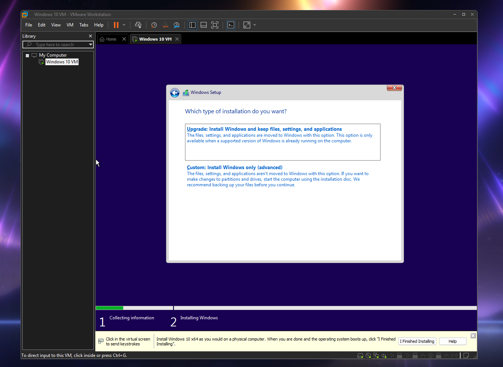
   - Select the virtual hard disk (50GB) and click **Next**.
    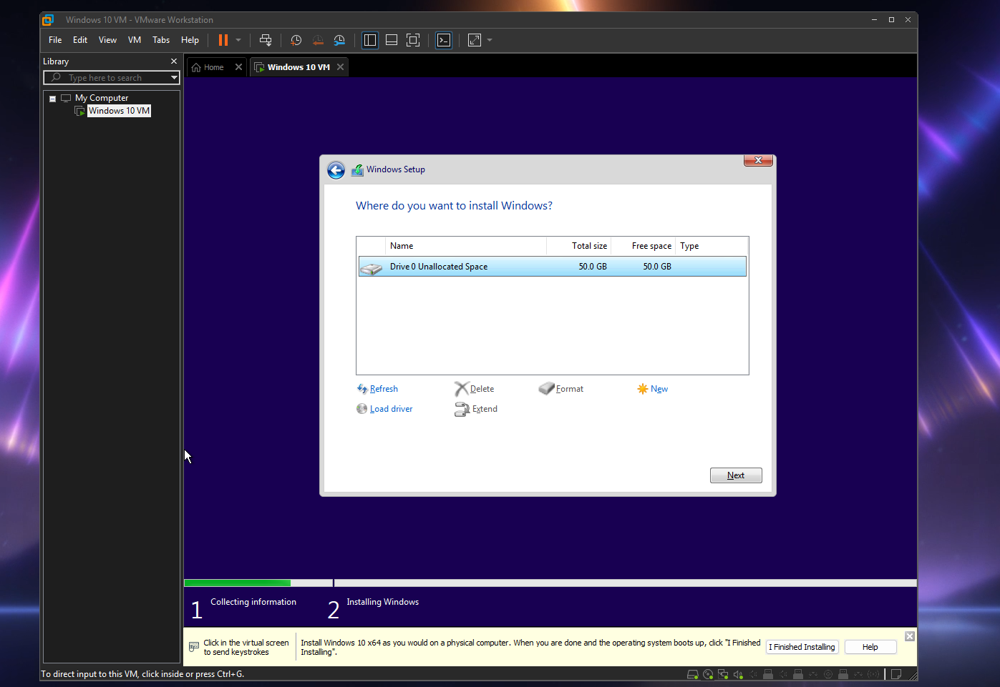
3. Wait for the installation to complete. The VM will restart several times.

---

## Step 5: Complete Windows 10 Setup
1. After installation, the VM will boot into the Windows 10 setup wizard:
   - Select your region and click **Yes**.
   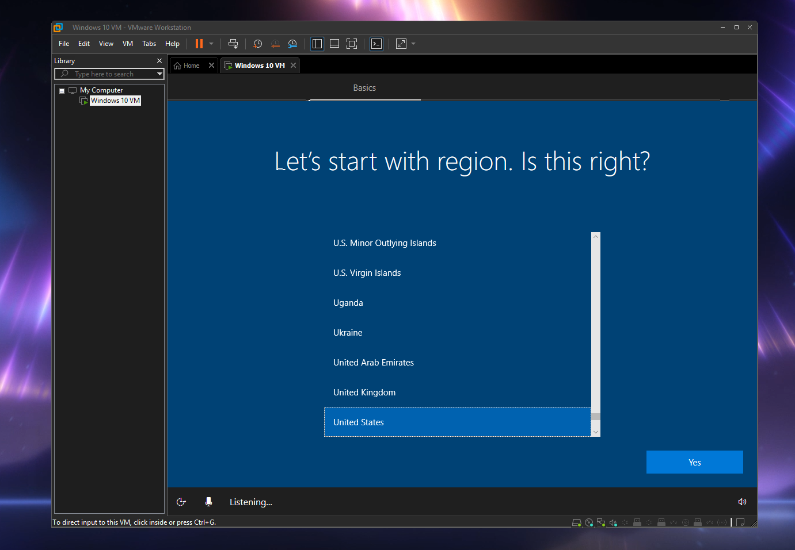
   - Choose your keyboard layout and click **Yes**.
   - Skip the second keyboard layout (if prompted).
2. **Sign in to Microsoft**:
   - Sign in with your Microsoft account (or create one if you don’t have an account).
   - Alternatively, click **Offline Account** to create a local account.
3. **Set Up a PIN**:
   - Create a PIN for easier sign-in (optional).
4. **Privacy Settings**:
   - Adjust privacy settings as desired and click **Accept**.
5. Wait for Windows to finalize the setup. You’ll be taken to the desktop.
    
    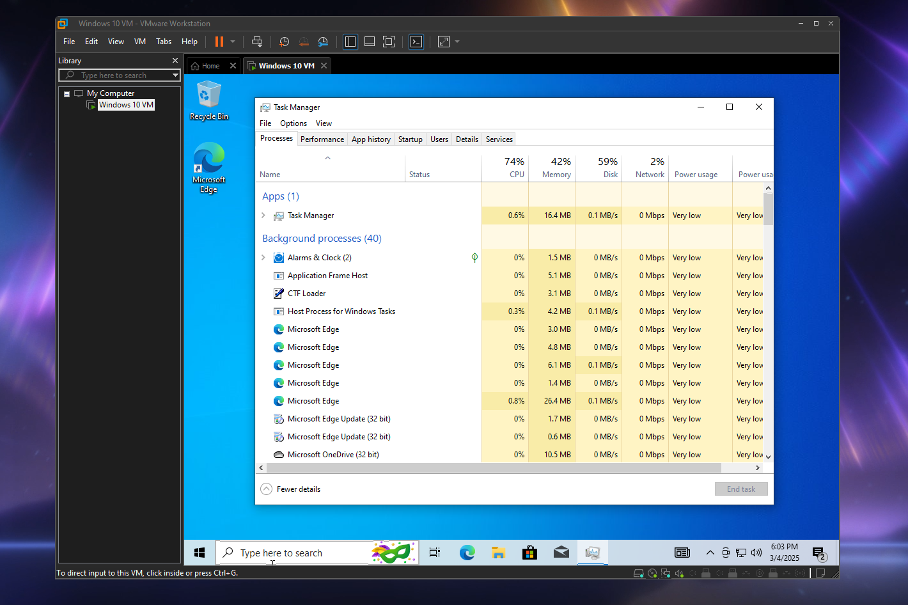
---

## Step 6: Install VMware Tools
1. **Start the VMware Tools Installation**:
   - In VMware Workstation Pro, go to **Player > Manage > Install VMware Tools**.
   - A dialog box will appear in the VM. Click **Download and Install**.

2. **Run the VMware Tools Installer**:
   - Open **File Explorer** in the VM and navigate to **This PC**.
   - Double-click the **DVD Drive (D:) VMware Tools** to start the installer.
   - Click **Next** to begin the installation.
    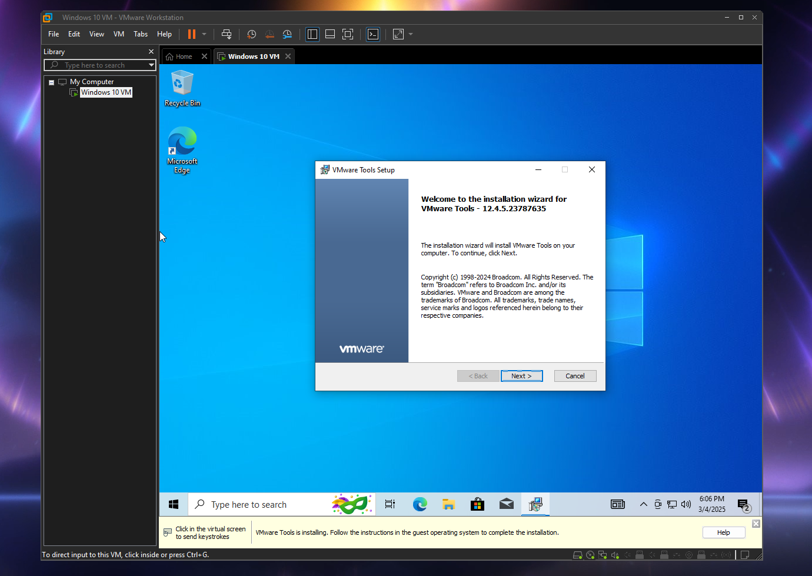
3. **Choose Setup Type**:
   - Select **Typical** and click **Next**.
    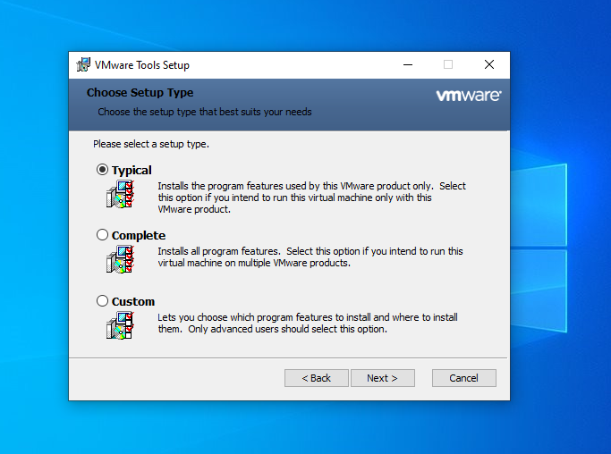
4. **Complete the Installation**:
   - Click **Install** to begin the installation process.
   - If prompted by Windows Security, click **Install** to allow VMware Tools to make changes to your system.
   - Wait for the installation to complete.

5. **Restart the VM**:
   - Once the installation is complete, click **Finish**.
   - Restart the VM when prompted.

6. **Verify VMware Tools**:
   - After the VM restarts, check the system tray for the VMware Tools icon (a small VMware logo).
   - Test features like:
     - **Drag-and-drop** between the host and VM.
     - **Clipboard sharing** (copy-paste between host and VM).
     - **Improved display resolution**.

---

## Step 7: Verify the VM
1. Test the VM by:
   - Opening a browser and visiting a website to check internet connectivity.
   - Checking the allocated resources (e.g., RAM, CPU) in Task Manager (Ctrl+Alt+Insert for VM to access task manager).