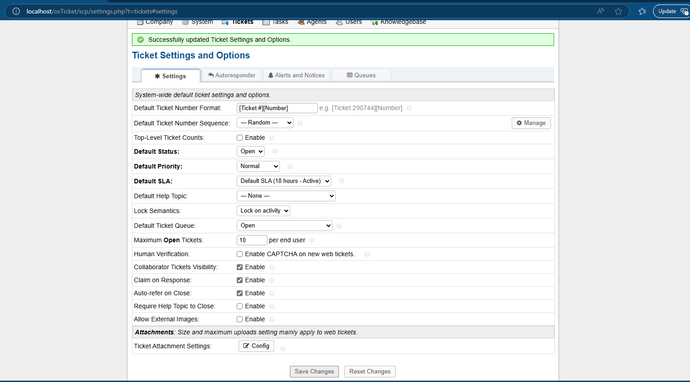
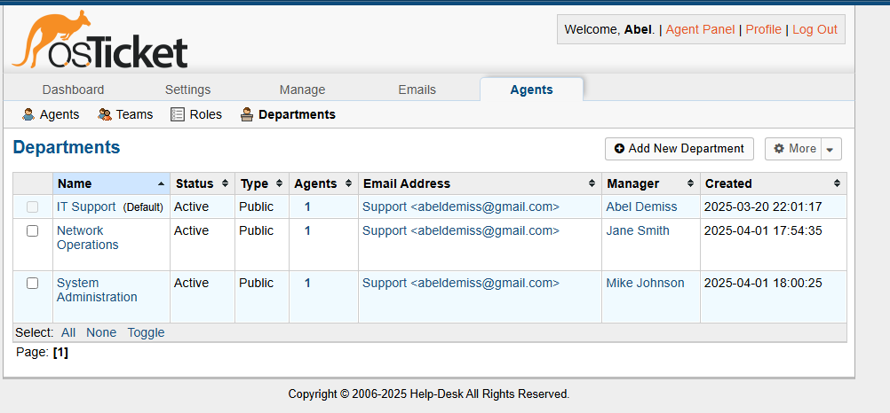
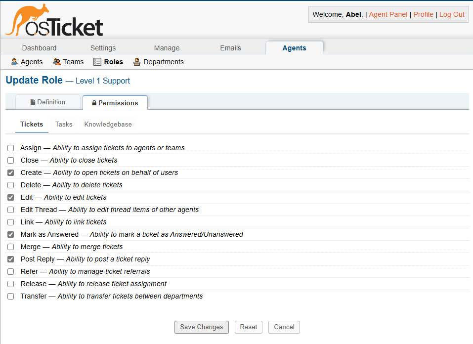

# osTicket Configuration Guide

This guide documents the configuration of osTicket for a professional help desk environment integrated with Active Directory. The configuration demonstrates IT service management best practices while creating a streamlined support workflow.

## Table of Contents
1. [Initial Admin Setup](#initial-admin-setup)
2. [Department Configuration](#department-configuration)
3. [Staff & Team Management](#staff--team-management)
4. [User Directory & Authentication](#user-directory--authentication)
5. [Help Topics & Ticket Categories](#help-topics--ticket-categories)
6. [SLA Plans & Service Management](#sla-plans--service-management)
7. [Email Integration](#email-integration)
8. [Knowledge Base Setup](#knowledge-base-setup)
9. [Active Directory Integration](#active-directory-integration)
10. [Workflow Automation](#workflow-automation)

## Initial Admin Setup

### Basic System Settings

1. Access the Admin Panel:
   - Navigate to http://localhost/osTicket/scp
   - Log in with administrator credentials

2. Configure System Settings:
   - Navigate to Admin Panel → Settings → System
   - Set Help Desk Name: `IT Help Desk`
   - Set Default Department: `Support`

3. Configure Ticket Settings:
   - Navigate to Admin Panel → Settings → Tickets
   - Set ticket number format: `[Ticket #][Number]` (under "Ticket Number Format")
   - Set the default ticket status to `Open` (under "Default Status")
   - Configure autoresponder settings (enable/disable as preferred)
   - Set Maximum Open Tickets per user (recommended: 10)


> Screenshot: Core system settings in osTicket admin panel

## Department Configuration

### Create Support Departments

1. Create IT Support Department:
   - Navigate to Admin Panel → Agents → Departments
   - Click `Add New Department`
   - Enter Name: `IT Support`
   - Email: `itsupport@domain.local`
   - Set Department Manager: `John Doe`
   - Define SLA: `Default SLA`
   - Click `Create Dept`

2. Create Additional Departments:
   ```
   Department: Network Operations
   Email: netops@domain.local
   Manager: Jane Smith
   
   Department: System Administration
   Email: sysadmin@domain.local
   Manager: Mike Johnson
   ```

3. Configure Department Access:
   - Assign appropriate staff to each department
   - Set up department email templates and signatures
   - Configure auto-response messages


> Screenshot: Department structure showing IT support hierarchy

## Staff & Team Management

### Create Staff Roles

1. Create Support Tiers:
   - Navigate to Admin Panel → Agents → Roles
   - Create the following roles:
     ```
     Role: Level 1 Support
     Permissions: Create/Edit Tickets, Search Tickets, Create/Edit KB Articles
     
     Role: Level 2 Support
     Permissions: All Level 1 + Delete Tickets, Assign Tickets
     
     Role: Administrator
     Permissions: Full System Access
     ```

2. Create Staff Accounts:
   - Navigate to Admin Panel → Agents → Add New
   - Create accounts for your support staff:
     ```
     Name: John Doe
     Email: john.doe@domain.local
     Department: IT Support
     Role: Administrator
     
     Name: Jane Smith
     Email: jane.smith@domain.local
     Department: Network Operations
     Role: Level 2 Support
     
     Name: Mike Johnson
     Email: mike.johnson@domain.local
     Department: System Administration
     Role: Level 2 Support
     ```

3. Create Support Teams:
   - Navigate to Admin Panel → Agents → Teams
   - Create Level 1 Support Team
   - Create Level 2 Support Team
   - Assign appropriate staff to each team


> Screenshot: Staff role configuration showing permissions

## User Directory & Authentication

### Configure User Settings

1. Configure User Settings:
   - Navigate to Admin Panel → Settings → User
   - Enable User Registration
   - Set Authentication Requirements
   - Configure Password Policy

2. Create Test Users:
   - Navigate to Agent Panel → Users → Add User
   - Create test user accounts that match your AD users:
     ```
     Name: Test User 1
     Email: testuser1@domain.local
     Organization: IT Department
     
     Name: Test User 2
     Email: testuser2@domain.local
     Organization: Marketing
     ```

## Help Topics & Ticket Categories

### Configure Help Topics

1. Create Common Help Topics:
   - Navigate to Admin Panel → Manage → Help Topics
   - Add the following topics:
     ```
     Topic: Password Reset
     Department: IT Support
     Priority: Medium
     SLA Plan: Default
     
     Topic: Network Connectivity Issues
     Department: Network Operations
     Priority: High
     SLA Plan: Urgent
     
     Topic: Software Installation Request
     Department: IT Support
     Priority: Low
     SLA Plan: Normal
     
     Topic: Account Access Issues
     Department: System Administration
     Priority: Medium
     SLA Plan: Default
     ```

2. Configure Auto-Assignment Rules:
   - Navigate to Admin Panel → Settings → Tickets
   - Set auto-assignment based on help topics and departments


> Screenshot: Help topics configuration showing priority assignment

## SLA Plans & Service Management

### Create Service Level Agreements

1. Configure SLA Plans:
   - Navigate to Admin Panel → Manage → SLA Plans
   - Create the following SLAs:
     ```
     Name: Urgent
     Grace Period: 1 hour
     Schedule: 24/7
     
     Name: High Priority
     Grace Period: 4 hours
     Schedule: 24/7
     
     Name: Normal
     Grace Period: 8 hours
     Schedule: Business Hours
     
     Name: Low
     Grace Period: 24 hours
     Schedule: Business Hours
     ```

2. Configure Business Hours:
   - Navigate to Admin Panel → Settings → Business Hours
   - Set standard business hours (e.g., Monday-Friday, 9am-5pm)


> Screenshot: SLA configuration showing different response time requirements

## Email Integration

### Configure Email Settings

1. Configure Email Settings:
   - Navigate to Admin Panel → Settings → Emails
   - Configure default system email
   - Set up outgoing SMTP settings

2. Create Email Templates:
   - Navigate to Admin Panel → Settings → Templates
   - Customize ticket creation confirmation
   - Create response templates
   - Update ticket update notification template

## Knowledge Base Setup

### Create Knowledge Base Articles

1. Create Categories:
   - Navigate to Admin Panel → Knowledgebase → Categories
   - Create categories like "Common Issues", "How-To Guides", "Password Policies"

2. Add Articles:
   - Navigate to Staff Panel → Knowledgebase → Add New
   - Create articles for common issues:
     ```
     Title: How to Reset Your Password
     Category: How-To Guides
     Visibility: Public
     
     Title: Connecting to the VPN
     Category: How-To Guides
     Visibility: Public
     
     Title: Requesting Software Installation
     Category: How-To Guides
     Visibility: Public
     ```

3. Format Articles:
   - Use clear headings and subheadings
   - Include step-by-step instructions
   - Add screenshots where helpful


> Screenshot: Knowledge base article showing formatting and step-by-step instructions

## Active Directory Integration

### Configure LDAP Authentication

1. Set Up LDAP Authentication:
   - Navigate to Admin Panel → Settings → Authentication
   - Enable LDAP authentication
   - Configure LDAP server settings:
     ```
     LDAP Host: 192.168.1.10 (Your DC IP)
     LDAP Port: 389
     LDAP Protocol Version: 3
     Base DN: DC=domain,DC=local
     LDAP Filter: (&(objectCategory=person)(objectClass=user))
     Bind DN: CN=Administrator,CN=Users,DC=domain,DC=local
     Bind Password: [your password]
     ```
   - Test LDAP connection

2. Configure User Synchronization:
   - Set up user attribute mapping
   - Configure group synchronization
   - Set automatic account creation for AD users


> Screenshot: LDAP configuration settings for Active Directory integration

## Workflow Automation

### Configure Automatic Actions

1. Create Ticket Filters:
   - Navigate to Admin Panel → Manage → Filters
   - Create filter for password reset auto-response
   - Create filter for after-hours notifications
   - Create filter for high-priority ticket escalation

2. Configure Canned Responses:
   - Navigate to Admin Panel → Agents → Canned Responses
   - Create common responses for:
     - Password reset instructions
     - Network troubleshooting steps
     - Service request acknowledgment
     - Resolution confirmation

3. Set Up Ticket Auto-Assignment:
   - Configure rules based on ticket categories
   - Set up round-robin assignment within teams
   - Configure escalation for SLA violations


> Screenshot: Ticket automation rules showing workflow configuration

## Testing the Configuration

1. Create a test ticket from the user portal
2. Process the ticket through its lifecycle:
   - Assignment
   - Response
   - Resolution
   - Closure
3. Verify email notifications are sending correctly
4. Confirm SLA timers are functioning properly
5. Test knowledge base search functionality

---

This configuration establishes a professional help desk environment with streamlined workflows, proper escalation paths, and integration with Active Directory. The system is designed to efficiently manage and resolve IT support issues while maintaining service level agreements.

For detailed information about using the system, see [Sample-Tickets.md](/Ticketing-System/Sample-Tickets.md) for examples of common support scenarios and their resolutions.
